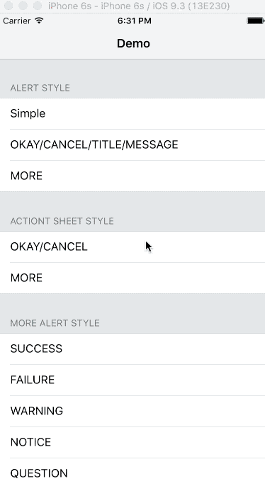

# Goku

<p align="center">

<a href="https://github.com/Carthage/Carthage/"></a>

<a href="http://cocoadocs.org/docsets/JESAlertView"></a>

<a href="https://raw.githubusercontent.com/ShiWeiCN/JESAlertView/master/LICENSE"></a>

<a href="http://cocoadocs.org/docsets/JESAlertView"></a>

<a href="https://github.com/ShiWeiCN/JESAlertView"></a>

</p>

**Goku** is an alert view written by swift 3, support both action sheet and alert view style. And now provide 6 styles to show your alert. If you want to use the world of Swift 3, you need Xcode 8+.

## Screenshots





## Easy to use

Provide a default theme of alert view. So you can use this default theme or create a theme you like.

```swift
import Goku

// 🌟 Usage 👇
	
self.goku.presentAlert(true, closure: { (make) in
	make.theme
		.actionSheet
		.title("Okay/Cancel")
		.message("A customizable action sheet message.")
		.cancel("Cancel")
		.destructive("OK")
		.normal(["Button1", "Button2"])
		.tapped({ (index) in
			print("Tapped index is \(index)")
		}
	)
})	

self.goku.presentAlert(true, closure: { (make) in
	make.theme
		.alert
		.success
		.title("Congratulations!")
		.message("You've just displayed this awesome Pop Up View.")
		.cancel("Cancel")
		.normal(["Default 1", "Default 2"])
		.tapped({ (index) in
			print("Index \(index)")
		}
	)
})
```
	
For more usage you can see [Example](https://github.com/ShiWeiCN/Goku)
    
> Icon image from [SCLAlertView](https://github.com/dogo/SCLAlertView)

## Installation

**Goku** is available through [Cocoapods](https://cocoapods.org/).

Add the following to you `Podfile`

```
pod 'Goku', '~> 1.0'
```

## TODO

- [ ] More animation
- [x] More beautiful syntax
- [x] Usage like `SnapKit`

## License

Goku is released under the MIT license. See LICENSE for details.

